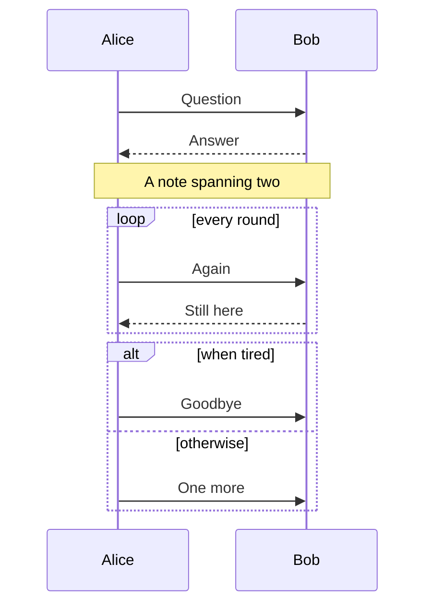

# Sequences

Participants, both message styles, a note, and a fragment:

```mermaid
sequenceDiagram
  participant A as Alice
  participant B as Bob
  A->>B: Question
  B-->>A: Answer
  Note over A,B: A note spanning two
  loop every round
    A->>B: Again
    B-->>A: Still here
  end
  alt when tired
    A->>B: Goodbye
  else otherwise
    A->>B: One more
  end
```
