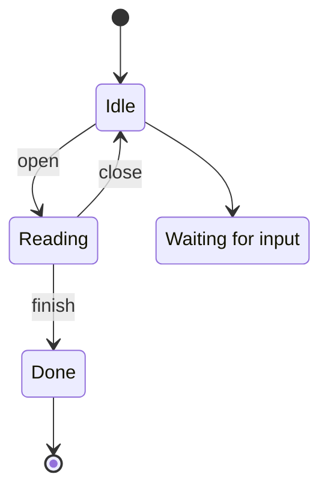

# States

```mermaid
stateDiagram-v2
  [*] --> Idle
  Idle --> Reading : open
  Reading --> Idle : close
  Reading --> Done : finish
  Done --> [*]
  state "Waiting for input" as Waiting
  Idle --> Waiting
```
